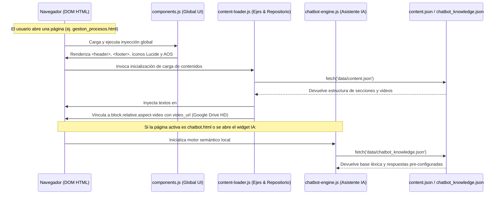
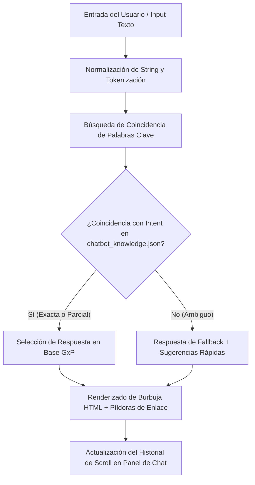

# Arquitectura de Datos e Interacción Dinámica

## 1. El Paradigma de Datos Desacoplados (Backend-Less)
El portal opera bajo un enfoque modular de **datos declarativos desacoplados**. Toda la información variable y el contenido técnico susceptible a actualizaciones periódicas (textos descriptivos de los ejes de gestión, videos explicativos, directivas legales del repositorio y base de respuestas del chatbot) se almacena independientemente de las plantillas HTML dentro del directorio `/data`.

---

## 2. Estructura de las Bases de Datos JSON (`/data`)

El sistema cuenta con dos archivos maestros en formato JSON:

### A. `data/content.json` (Contenidos Generales y Repositorio)
Estructurado en tres ramas principales que alimentan las secciones informativas del portal:
- **`sections`:** Arreglo de objetos identificados por el slug de cada eje (`"id": "gestion-procesos"`, `"gestion-conocimiento"`, etc.). Contiene los textos de las 5 secciones estándar (*Definición*, *Finalidad*, *Fases*, *Roles*) y los hipervínculos multimedia (`video_url` y `video_title` apuntando a repositorios en la nube como Google Drive).
- **`repository`:** Catálogo general de directivas, manuales y herramientas de la institución categorizados por las **4 Pestañas del Repositorio** (`normatividad`, `conocimiento`, `innovacion`, `publicaciones`).
- **`updates` o `meta`:** Registro de auditoría y metadatos con fecha de última revisión oficial para control documental.

### B. `data/chatbot_knowledge.json` (Base Semántica del Asistente IA)
Estructurado modularmente para el consumo veloz por el motor del chatbot:
- **`intents` o Categorías de Consulta:** Mapeo de flujos conversacionales (saludos, consultas de MOP, cómo redactar una directiva, dónde encontrar plantillas Word).
- **`keywords`:** Palabras clave asociadas para coincidencia léxica inteligente.
- **`responses`:** Textos formateados en HTML o Markdown con enlaces directos hacia las directivas exactas en `repositorio.html`.

---

## 3. Ciclo de Vida del Renderizado y Cargadores (`js/`)

El flujo de procesamiento de contenidos entre el sistema de archivos y el navegador sigue este orden jerárquico:

---

## 4. Motor de Carga Dinámica (`js/content-loader.js`)

El archivo **`content-loader.js`** es el encargado de enlazar la interfaz estática con los datos en formato JSON:
1. **Identificación de Página:** Lee el atributo semántico `data-page-id` en el `<body>` de la página actual (`gestion-procesos`, `gestion-conocimiento`, etc.).
2. **Inyección en Secciones Estandarizadas:** Rellena los contenedores de texto sin requerir que el administrador modifique la estructura HTML.
3. **Vinculación Dinámica de Video Explicativo:** Si detecta la propiedad `"video_url"` y es diferente de `"#"` o vacía, actualiza la propiedad `href` del contenedor multimedia (`#multimedia a`) y establece `target="_blank"` para asegurar que la reproducción del video de Google Drive ocurra fluidamente en una pestaña independiente.
4. **Alimentación del Repositorio (`repositorio.html`):** Si la página activa es el Repositorio, procesa la colección `"repository"`, clasifica los documentos según su categoría en las **4 pestañas activas** e inyecta las filas en las tablas correspondientes antes de disparar la inicialización de **DataTables**.

---

## 5. Arquitectura del Asistente IA (`js/chatbot-engine.js`)

El Asistente IA del portal opera bajo una arquitectura conversacional ligera sin latencia de red de servidores remotos:

- **Cero Dependencia de Servidores Remotos:** Al procesar la búsqueda léxica y semántica del lado del cliente (`client-side`) sobre `chatbot_knowledge.json`, el asistente responde en milisegundos y funciona sin problemas incluso bajo firewalls restrictivos de oficinas gubernamentales.

---

## 6. Interfaz y Flujo de las Tablas DataTables (`repositorio.html`)

- **Estructura en 4 Pestañas (`normatividad`, `conocimiento`, `innovacion`, `publicaciones`):** Cada pestaña cuenta con su propia organización documental. Específicamente, **`conocimiento`** despliega una jerarquía de **5 sub-acordeones** con tablas estandarizadas de registros validados por el **ETMC** (Lecciones Aprendidas, Buenas Prácticas, Guías Técnicas 5W+2H, Actas Offboarding) y una cuadrícula responsiva de **5 Micro-Cursos** de autoaprendizaje (incluyendo Inteligencia Artificial).
- **Búsqueda Instantánea Multi-columna:** El buscador de DataTables filtra en milisegundos por título de directiva, año, código o descripción.
- **Botones de Exportación (`pdfMake`, `JSZip`):** Integración nativa de botones para exportar el listado oficial a **Excel (.xlsx)**, **PDF corporativo** o mandar directo a **Impresión (`print`)** con formato optimizado.
