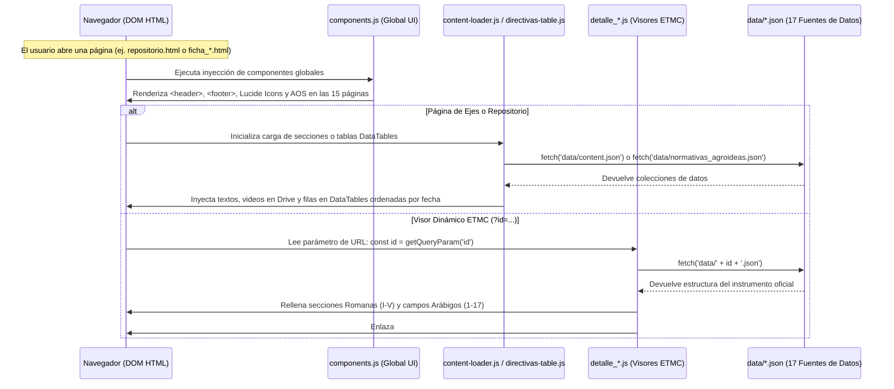
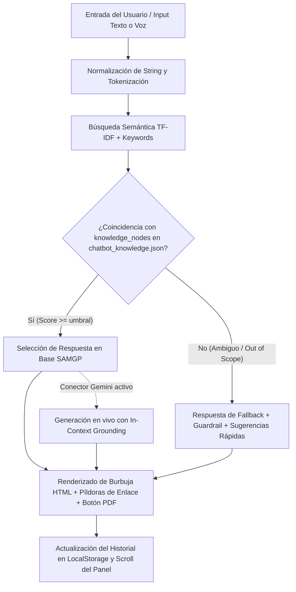
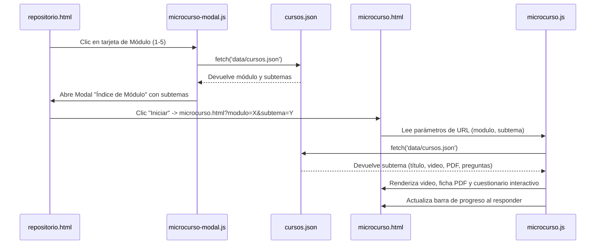

# Arquitectura de Datos e Interacción Dinámica

## 1. El Paradigma de Datos Desacoplados (Backend-Less)
El portal opera bajo un enfoque modular de **datos declarativos desacoplados**. Toda la información variable y el contenido técnico susceptible a actualizaciones periódicas (textos descriptivos de los ejes de gestión, videos explicativos en Drive, catálogo de directivas legales, corpus normativo del chatbot, currícula de micro-cursos y casos de simulación de instrumentos ETMC) se almacena independientemente de las plantillas HTML dentro del directorio `/data` a través de un ecosistema de **17 archivos JSON**.

---

## 2. Estructura de las Bases de Datos JSON (`/data`)

El sistema organiza sus fuentes de datos en 4 grupos especializados:

### A. Datos Generales y Catálogo Institucional
1. **`data/content.json` (Contenidos Generales y Repositorio):**
   - **`sections`:** Arreglo de objetos identificados por el slug de cada eje (`"id": "gestion-procesos"`, etc.). Contiene los textos de las 5 secciones estándar (*Definición*, *Finalidad*, *Fases*, *Roles*) y los hipervínculos multimedia (`video_url` y `video_title` apuntando a Google Drive).
   - **`repository`:** Catálogo general de directivas, manuales y herramientas categorizados por las 4 pestañas del repositorio.
   - **`meta`:** Metadatos institucionales y control de versiones.
2. **`data/normativas_agroideas.json` (Catálogo Oficial de Directivas y Normas):**
   - Colección estructurada de directivas institucionales, resoluciones de dirección ejecutiva y guías metodológicas con campos: `"numero"`, `"nombre"`, `"anio"`, `"fecha_aprobacion"`, `"categoria"` y `"enlace_drive"`. Consumido por `js/directivas-table.js` para alimentar la Pestaña *1. Normatividad* con ordenamiento cronológico.

### B. Motor Conversacional IA
3. **`data/chatbot_knowledge.json` (Corpus Normativo del Asistente IA):**
   - **`metadata`:** Versión oficial (`2026.6`), fecha y total de módulos normativos (9).
   - **`categories`:** Lista de las **9 categorías normativas** (Marco General, Política 2030, Reglamento SAMGP, Procesos, Calidad, Conocimiento, Innovación, Organización del Estado e **Instructivos Operativos**).
   - **`knowledge_nodes`:** Nodos de conocimiento con `id`, `category`, `title`, `source`, `pdf_path` (enlace al PDF local en `MARCO NORMATIVO SAMGP 2026/`), `keywords`, `question_patterns`, `answer` (HTML) y `quick_prompt`.

### C. Aula Virtual de Micro-Cursos
4. **`data/cursos.json` (Currícula de Micro-Cursos):**
   - **`modulos`:** Arreglo de 5 módulos temáticos (`modulo1` a `modulo5`) con `id`, `titulo`, `eje` (A–E), `descripcion` y `subtemas`.
   - **`subtemas`:** Cada subtema (`A.1`, `A.2`, etc.) contiene `id`, `titulo`, `descripcion`, `video_url`, `pdf_url` y `preguntas`.
   - **`preguntas`:** Cuestionario interactivo con `pregunta`, `opciones` y `respuestaCorrecta`.

### D. Muestras Documentales de Instrumentos ETMC (13 archivos / 12 casos)
Archivos de datos de simulación que alimentan los 4 visores dinámicos desacoplados, todos incluyendo la propiedad oficial `"Link"` con la URL de Google Drive hacia el documento formal en PDF:
5. **Grupo Fichas de Lecciones Aprendidas - FLA (Anexo 01):**
   - `data/simulacion-registro-fla-1-1.json` (`LA-UR_SAN_MARTIN-004-2026`)
   - `data/simulacion-registro-fla-1-2.json` (`LA-USE-003-2026`)
   - `data/simulacion-registro-fla-1-3.json` (`LA-UPDC-001-2026`)
6. **Grupo Fichas de Buenas Prácticas - FBP (Anexo 02):**
   - `data/simulacion-registro-fbp-2-1.json` (`BP-UR_AREQUIPA-001-2026`)
   - `data/simulacion-registro-fbp-2-2.json` (`BP-UR_AREQUIPA-001-2026 v2`)
   - `data/simulacion-registro-fbp-2-3.json` y `data/simulacion-registro-fbp-2-3..json` (`BP-UA-002-2026`)
7. **Grupo Guías Técnicas de Saber Hacer - GT-SH (Anexo 03):**
   - `data/simulacion-registro-GT-SH-3-1.json` (`GT-SH-NEG-001-2026`)
   - `data/simulacion-registro-GT-SH-3-2.json` (`GT-SH-NEG-001-2026 v2`)
   - `data/simulacion-registro-GT-SH-3-3.json` (`GT-SH-NEG-001-2026 v3`)
8. **Grupo Actas de Transferencia de Conocimiento - TCO (Anexo 04):**
   - `data/Formato-registro-TCO-4-1.json` (Acta de entrega de puesto offboarding)
   - `data/Formato-registro-TCO-4-2.json` (Acta de entrega de puesto offboarding v2)
   - `data/Formato-registro-TCO-4-3.json` (Acta de entrega de puesto offboarding v3)

---

## 3. Ciclo de Vida del Renderizado y Cargadores (`js/`)

El flujo de procesamiento de contenidos entre el sistema de archivos y el navegador sigue este orden jerárquico:


```mermaid
sequenceDiagram
    participant B as Navegador (DOM HTML)
    participant C as components.js (Global UI)
    participant L as content-loader.js / directivas-table.js
    participant D as detalle_*.js (Visores ETMC)
    participant J as data/*.json (17 Fuentes de Datos)

    Note over B: El usuario abre una página (ej. repositorio.html o ficha_*.html)
    B->>C: Ejecuta inyección de componentes globales
    C->>B: Renderiza <header>, <footer>, Lucide Icons y AOS en las 15 páginas
    alt Página de Ejes o Repositorio
        B->>L: Inicializa carga de secciones o tablas DataTables
        L->>J: fetch('data/content.json') o fetch('data/normativas_agroideas.json')
        J-->>L: Devuelve colecciones de datos
        L->>B: Inyecta textos, videos en Drive y filas en DataTables ordenadas por fecha
    else Visor Dinámico ETMC (?id=...)
        B->>D: Lee parámetro de URL: const id = getQueryParam('id')
        D->>J: fetch('data/' + id + '.json')
        J-->>D: Devuelve estructura del instrumento oficial
        D->>B: Rellena secciones Romanas (I-V) y campos Arábigos (1-17)
        D->>B: Enlaza #btn-imprimir-pdf con window.open(data.Link, '_blank')
    end
```

---

## 4. Motores de Carga Dinámica

### A. Cargador General (`js/content-loader.js`)
1. **Identificación de Página:** Lee el atributo semántico `data-page-id` en el `<body>` de la página actual.
2. **Inyección en Secciones:** Rellena los contenedores de texto `#definition`, `#purpose`, `#phases`, `#roles`.
3. **Vinculación de Videos:** Si detecta la propiedad `"video_url"`, actualiza el contenedor `#multimedia a` con `target="_blank"` hacia Google Drive.
4. **Alimentación del Repositorio:** Distribuye los documentos en las 4 pestañas de `repositorio.html`.

### B. Motor de Normativas (`js/directivas-table.js`)
- Consume de forma asíncrona `data/normativas_agroideas.json`.
- Construye la tabla de directivas institucionales con badges diferenciados por categoría.
- Aplica ordenamiento cronológico descendente basado en la fecha de aprobación.
- Genera el botón de acceso directo al PDF en Google Drive.

### C. Controladores de Visores ETMC (`js/detalle_*.js`)
- **`js/detalle_ficha.js` (FLA):** Mapea los 17 campos del Anexo 01 y genera la tabla de criterios SGP-PCM.
- **`js/detalle_buena_practica.js` (FBP):** Mapea problema, solución innovadora, factores clave y lecciones del Anexo 02.
- **`js/detalle_guia_tecnica.js` (GT-SH):** Procesa el paso a paso del Anexo 03, destacando las cajas de alerta roja, atajos y contingencias.
- **`js/detalle_transferencia.js` (TCO):** Extrae los datos generales del puesto, contactos clave, proyectos y estado de entrega del Anexo 04.
- **Comportamiento común `#btn-imprimir-pdf`:**
  ```javascript
  const btnPdf = document.getElementById('btn-imprimir-pdf');
  if (btnPdf) {
      btnPdf.addEventListener('click', (e) => {
          e.preventDefault();
          const linkPdf = data.Link || (data.MetadatosTrazabilidad && data.MetadatosTrazabilidad.Link);
          if (linkPdf && linkPdf !== '#' && linkPdf.startsWith('http')) {
              window.open(linkPdf, '_blank', 'noopener,noreferrer');
          } else {
              window.print();
          }
      });
  }
  ```

---

## 5. Arquitectura del Asistente IA (`js/chatbot-engine.js`)

El Asistente IA opera bajo una arquitectura **RAG local (Retrieval-Augmented Generation)** con búsqueda semántica TF-IDF, sin latencia de red de servidores remotos, y con un **conector opcional a Google Gemini**:


```mermaid
graph TD
    A[Entrada del Usuario / Input Texto o Voz] --> B[Normalización de String y Tokenización]
    B --> C[Búsqueda Semántica TF-IDF + Keywords]
    C --> D{¿Coincidencia con knowledge_nodes en chatbot_knowledge.json?}
    D -- Sí (Score >= umbral) --> E[Selección de Respuesta en Base SAMGP]
    D -- No (Ambiguo / Out of Scope) --> F[Respuesta de Fallback + Guardrail + Sugerencias Rápidas]
    E --> G[Renderizado de Burbuja HTML + Píldoras de Enlace + Botón PDF]
    F --> G
    G --> H[Actualización del Historial en LocalStorage y Scroll del Panel]
    E -. Conector Gemini activo .-> I[Generación en vivo con In-Context Grounding]
    I --> G
```

- **Indexación Local:** El corpus se indexa en `samgp_knowledge_base`, el historial en `samgp_chat_history` y los ajustes en `samgp_chatbot_settings`.
- **Guardrail Fuera de Alcance:** Respuestas de contingencia formal delimitando el marco legal SAMGP.
- **Reconocimiento de Voz:** Integración nativa con `webkitSpeechRecognition`.

---

## 6. Interfaz y Flujo de las Tablas DataTables (`repositorio.html`)

- **Estructura en 4 Pestañas (`normatividad`, `conocimiento`, `innovacion`, `publicaciones`):** Cada pestaña cuenta con su propia organización documental. Específicamente, **`conocimiento`** despliega una jerarquía de **4 sub-acordeones** con tablas estandarizadas de registros validados por el **ETMC** (Lecciones Aprendidas, Buenas Prácticas, Guías Técnicas 5W+2H, Actas Offboarding) y una cuadrícula responsiva de **5 Micro-Cursos** de autoaprendizaje.
- **Búsqueda Instantánea y Ordenamiento Cronológico:** El buscador filtra en milisegundos por título, año o código. Las tablas de normativas se inicializan con orden cronológico descendente (`order: [[2, 'desc']]` o índice de fecha correspondiente).
- **Botones de Exportación (`pdfMake`, `JSZip`):** Integración nativa para exportar a **Excel (.xlsx)**, **PDF** o mandar directo a **Impresión**.

---

## 7. Flujo SPA de los Micro-Cursos (`microcurso.js` + `microcurso-modal.js`)


```mermaid
sequenceDiagram
    participant R as repositorio.html
    participant M as microcurso-modal.js
    participant C as cursos.json
    participant A as microcurso.html
    participant J as microcurso.js

    R->>M: Clic en tarjeta de Módulo (1-5)
    M->>C: fetch('data/cursos.json')
    C-->>M: Devuelve módulo y subtemas
    M->>R: Abre Modal "Índice de Módulo" con subtemas
    R->>A: Clic "Iniciar" -> microcurso.html?modulo=X&subtema=Y
    A->>J: Lee parámetros de URL (modulo, subtema)
    J->>C: fetch('data/cursos.json')
    C-->>J: Devuelve subtema (título, video, PDF, preguntas)
    J->>A: Renderiza video, ficha PDF y cuestionario interactivo
    J->>A: Actualiza barra de progreso al responder
```

- **`microcurso-modal.js`:** Carga la data en el modal de la pantalla principal y gestiona la apertura/cierre. Soporta `?openModal=moduloX` para deep-linking directo.
- **`microcurso.js`:** Lee los parámetros de URL, inyecta los datos del subtema y procesa la interactividad del cuestionario (validación de respuestas y barra de progreso).

---

*Unidad de Planeamiento y Presupuesto (UPP) - AGROIDEAS | Modernización del Estado 2026*
