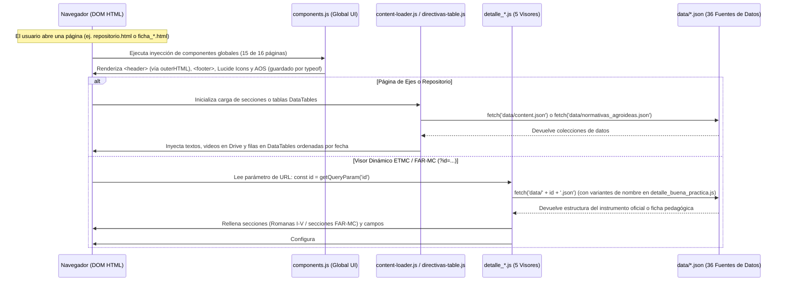
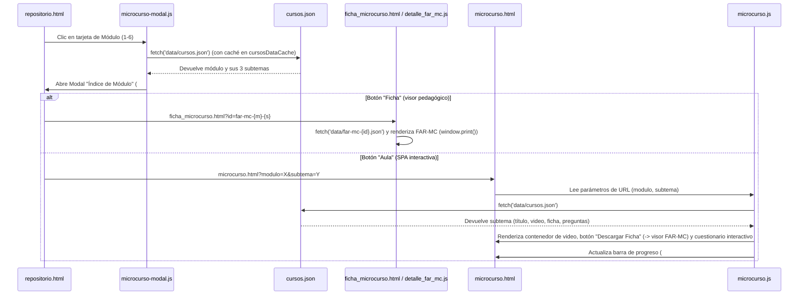

# Arquitectura de Datos e Interacción Dinámica

## 1. El Paradigma de Datos Desacoplados (Backend-Less)
El portal opera bajo un enfoque modular de **datos declarativos desacoplados**. Toda la información variable y el contenido técnico susceptible a actualizaciones periódicas (textos descriptivos de los ejes de gestión, videos explicativos en Drive, catálogo de **43 directivas** legales, corpus normativo del chatbot, currícula de **6 micro-cursos con 18 subtemas**, casos de instrumentos ETMC y las **18 fichas pedagógicas FAR-MC**) se almacena independientemente de las plantillas HTML dentro del directorio `/data` a través de un ecosistema de **36 archivos JSON**.

---

## 2. Estructura de las Bases de Datos JSON (`/data`)

El sistema organiza sus **36 fuentes de datos** en 4 grupos especializados:

### A. Datos Generales y Catálogo Institucional
1. **`data/content.json` (Contenidos Generales y Repositorio):**
   - **`sections`:** Arreglo de objetos identificados por el slug de cada eje (`"id": "gestion-procesos"`, etc.). Contiene los textos de las secciones estándar (*Definición*, *Finalidad*, *Fases*, *Roles*) y los hipervínculos multimedia (`video_url` y `video_title` apuntando a Google Drive).
   - **`documents`:** Tarjetas del Hub de Documentos de Gestión (`doc_gestion.html`).
   - **`repository`:** Catálogo operativo con:
     - `innovacion_tablas`: 3 tablas de la pestaña *Innovación* (`fichas_iniciativa` FIIP, `reportes_evaluacion`, `fichas_innovacion`) renderizadas en `[data-innov-table]`.
     - `publicaciones_upp`: Biblioteca de publicaciones UPP con campos reales `title`, `desc`, `category`, `status`, `url`, cargada en `#repoTable`.
     - `directivas`: subárbol heredado **no consumido** por el loader actual (la tabla de normatividad se alimenta de `normativas_agroideas.json`); se conserva por trazabilidad documental.
2. **`data/normativas_agroideas.json` (Catálogo Oficial de Directivas y Normas):**
   - **Arreglo plano de 43 registros** con los campos reales: `titulo`, `resolucion_aprobatoria`, `enlace` (URL oficial gob.pe), `fecha` (texto en español convertido internamente a ISO) y `descripcion`. Consumido por `js/directivas-table.js` para alimentar la Pestaña *1. Normatividad* con ordenamiento cronológico descendente.

### B. Motor Conversacional IA
3. **`data/chatbot_knowledge.json` (Corpus Normativo del Asistente IA):**
   - **`metadata`:** Versión oficial (`2026.6`), fecha de actualización y total de módulos normativos (9).
   - **`categories`:** Lista de **10 entradas** (la primera es el fáctico `"all"` —"Todos los Temas"— más las 9 categorías temáticas: `marco_modernizacion`, `politica_2030`, `reglamento_samgp`, `gestion_procesos`, `gestion_calidad`, `gestion_conocimiento`, `innovacion_publica`, `organizacion_estado`, `instructivos_agroideas`).
   - **`knowledge_nodes`:** **24 nodos** de conocimiento con `id`, `category`, `title`, `source`, `pdf_path` (ruta al PDF en `MARCO NORMATIVO SAMGP 2026/`), `keywords[]`, `question_patterns[]`, `answer` (HTML) y `quick_prompt`.

> [!WARNING]
> **Control de caché:** El engine (`js/chatbot-engine.js`) exige `metadata.version === "2026.7"` para reutilizar la caché `samgp_knowledge_base`, pero el JSON declara `"version": "2026.6"`; por tanto, la caché se regenera en cada carga. Sincroniza ambas versiones si deseas aprovechar la caché local.

### C. Aula Virtual de Micro-Cursos y Fichas Pedagógicas FAR-MC (19 archivos)
4. **`data/cursos.json` (Currícula de Micro-Cursos):**
   - **`modulos`:** Arreglo de **6 módulos temáticos** (`modulo1` Inducción en Modernización [EJE TRANSVERSAL / SAMGP], `modulo2` Gestión por Procesos [EJE A], `modulo3` Gestión del Conocimiento [EJE B], `modulo4` Innovación [EJE C], `modulo5` Herramientas de IA [EJE TECNOLOGÍA E IA], `modulo6` Calidad de los Servicios [EJE D]) con `id`, `titulo`, `eje`, `descripcion` y `subtemas`.
   - **`subtemas`:** **3 subtemas por módulo (18 en total)** con IDs heterogéneos (`M1.1–M1.3`, `A.1–A.3`, `B.1–B.3`, `C.1–C.3`, `E.1–E.3`, `D.1–D.3`). Cada subtema contiene `id`, `titulo`, `descripcion`, `video_url`, `pdf_url` y `preguntas`.
   - **`preguntas`:** Cuestionario interactivo con `pregunta`, `opciones` (3) y `respuestaCorrecta`.
5. **Fichas FAR-MC (18 archivos):** `data/far-mc-{m}-{s}.json` (far-mc-1-m1..m3, far-mc-2-a1..a3, far-mc-3-b1..b3, far-mc-4-c1..c3, far-mc-5-e1..e3, far-mc-6-d1..d3), una por subtema. Cada ficha es un objeto único con 6 secciones raíz: `NavegacionYTrazabilidad`, `MetadatosFicha`, `SintesisEjecutiva`, `NucleoSaberYMarcoNormativo`, `ToqueDelExpertoYAlertasCampo` y `CierreOperativoYAutoevaluacion`.
6. **`data/far-mc-v2.json` (Esquema Oficial FAR-MC V2.0):** JSON Schema draft-07 que define la estructura, tipos y campos obligatorios de las fichas pedagógicas. **Archivo de especificación**, no referenciado directamente por ningún script (usarlo para validar fichas nuevas).

### D. Muestras Documentales de Instrumentos ETMC (13 archivos / 12 casos)
Archivos de datos de simulación que alimentan los 4 visores ETMC dinámicos, todos incluyendo la propiedad oficial `"Link"` con la URL de Google Drive hacia el documento formal en PDF:
7. **Grupo Fichas de Lecciones Aprendidas - FLA (Anexo 01):**
   - `data/simulacion-registro-fla-1-1.json` (`LA-UR_SAN_MARTIN-004-2026`)
   - `data/simulacion-registro-fla-1-2.json` (`LA-USE-003-2026`)
   - `data/simulacion-registro-fla-1-3.json` (`LA-UPDC-001-2026`)
8. **Grupo Fichas de Buenas Prácticas - FBP (Anexo 02):**
   - `data/simulacion-registro-fbp-2-1.json` (`BP-UR_AREQUIPA-001-2026`)
   - `data/simulacion-registro-fbp-2-2.json` (`BP-UR_AREQUIPA-001-2026 v2`)
   - `data/simulacion-registro-fbp-2-3.json` (`BP-UA-002-2026`)
   - `data/simulacion-registro-fbp-2-3..json` (duplicado byte a byte del anterior, con nombre de doble punto; enlazado así desde el acordeón 2.2 de `repositorio.html`, pendiente de saneamiento)
9. **Grupo Guías Técnicas de Saber Hacer - GT-SH (Anexo 03):**
   - `data/simulacion-registro-GT-SH-3-1.json` (`GT-SH-NEG-001-2026`)
   - `data/simulacion-registro-GT-SH-3-2.json` (`GT-SH-NEG-001-2026 v2`)
   - `data/simulacion-registro-GT-SH-3-3.json` (`GT-SH-NEG-001-2026 v3`)
10. **Grupo Actas de Transferencia de Conocimiento - TCO (Anexo 04):**
    - `data/Formato-registro-TCO-4-1.json` (Acta de entrega de puesto offboarding)
    - `data/Formato-registro-TCO-4-2.json` (Acta de entrega de puesto offboarding v2)
    - `data/Formato-registro-TCO-4-3.json` (Acta de entrega de puesto offboarding v3)

---

## 3. Ciclo de Vida del Renderizado y Cargadores (`js/`)

El flujo de procesamiento de contenidos entre el sistema de archivos y el navegador sigue este orden jerárquico:


```mermaid
sequenceDiagram
    participant B as Navegador (DOM HTML)
    participant C as components.js (Global UI)
    participant L as content-loader.js / directivas-table.js
    participant D as detalle_*.js (5 Visores)
    participant J as data/*.json (36 Fuentes de Datos)

    Note over B: El usuario abre una página (ej. repositorio.html o ficha_*.html)
    B->>C: Ejecuta inyección de componentes globales (15 de 16 páginas)
    C->>B: Renderiza <header> (vía outerHTML), <footer>, Lucide Icons y AOS (guardado por typeof)
    alt Página de Ejes o Repositorio
        B->>L: Inicializa carga de secciones o tablas DataTables
        L->>J: fetch('data/content.json') o fetch('data/normativas_agroideas.json')
        J-->>L: Devuelve colecciones de datos
        L->>B: Inyecta textos, videos en Drive y filas en DataTables ordenadas por fecha
    else Visor Dinámico ETMC / FAR-MC (?id=...)
        B->>D: Lee parámetro de URL: const id = getQueryParam('id')
        D->>J: fetch('data/' + id + '.json') (con variantes de nombre en detalle_buena_practica.js)
        J-->>D: Devuelve estructura del instrumento oficial o ficha pedagógica
        D->>B: Rellena secciones (Romanas I-V / secciones FAR-MC) y campos
        D->>B: Configura #btn-imprimir-pdf (window.open(data.Link) en ETMC / window.print() en FAR-MC)
    end
```

---

## 4. Motores de Carga Dinámica

### A. Cargador General (`js/content-loader.js`)
1. **Identificación de Página:** Lee el atributo semántico `data-page-id` en el `<body>` de la página actual (presente en las 4 páginas de ejes y en `repositorio.html`).
2. **Inyección en Secciones:** Rellena los contenedores de texto `#definition p`, `#purpose p`, las grillas `#phases .grid` y `#roles .grid`, y el bloque `#multimedia` con `video_url` y `video_title`.
3. **Vinculación de Videos:** Si detecta la propiedad `"video_url"`, actualiza el contenedor `#multimedia a` con `target="_blank"` hacia Google Drive.
4. **Alimentación del Repositorio:** Dentro de `repositorio.html` (`body[data-page-id="repositorio"]`):
   - Renderiza las **3 tablas de Innovación** (FIIP / Informes de Evaluación / Fichas de Innovación) vía `renderInnovTable()` sobre los contenedores `[data-innov-table]`.
   - Carga la biblioteca **`publicaciones_upp`** en `#repoTable tbody` y reinicia el DataTable vía `window.initRepoTable()`.
   - *Dato huérfano:* el subárbol `repository.directivas` de `content.json` ya no es consumido por el loader (la tabla de normatividad la procesa `directivas-table.js`).

### B. Motor de Normativas (`js/directivas-table.js`)
- Consume de forma asíncrona `data/normativas_agroideas.json` (**43 registros**) sobre la tabla `#tablaDirectivas`.
- Construye las columnas `titulo` (24%), `resolucion_aprobatoria` (18%), `fecha` (13%, con conversión `fechaTextoAISO()` del texto español a ISO para sorteo), `descripcion` (35%) y `enlace` (10%, botón "Ver norma", no ordenable/buscable).
- Aplica ordenamiento cronológico descendente (`order: [[2, 'desc']]`), paginación (lengthMenu 10/15/20/30/50) e i18n completo en español.
- Expone **4 botones de exportación** (DataTables Buttons + JSZip + pdfMake): **copy, excel (.xlsx), pdf (A4 landscape) y print**, excluyendo la columna de enlace (`exportOptions.columns: [0,1,2,3]`).

### C. Controladores de Visores Desacoplados (`js/detalle_*.js`)
- **`js/detalle_ficha.js` (FLA):** Mapea los 17 campos del Anexo 01 y genera la tabla de criterios SGP-PCM.
- **`js/detalle_buena_practica.js` (FBP):** Mapea problema, solución innovadora, factores clave y lecciones del Anexo 02. Incluye fallback de variantes de nombre de archivo (por ello resuelve el enlace heredado con doble punto `simulacion-registro-fbp-2-3..json`).
- **`js/detalle_guia_tecnica.js` (GT-SH):** Procesa el paso a paso del Anexo 03, destacando las cajas de alerta roja, atajos y contingencias.
- **`js/detalle_transferencia.js` (TCO):** Extrae los datos generales del puesto, contactos clave, proyectos y estado de entrega del Anexo 04.
- **`js/detalle_far_mc.js` (FAR-MC):** Carga la ficha pedagógica del micro-curso (objeto único con `NavegacionYTrazabilidad`, `MetadatosFicha`, `SintesisEjecutiva`, `NucleoSaberYMarcoNormativo`, `ToqueDelExpertoYAlertasCampo`, `CierreOperativoYAutoevaluacion`) y configura la impresión directa con estilos `@media print`.
- **Manejo de raíz del JSON:** Los controladores ETMC soportan que el archivo raíz sea un objeto o un arreglo (usan `[0]`); el controlador FAR-MC espera un objeto único.
- **Comportamiento común `#btn-imprimir-pdf` (visores ETMC):**
  ```javascript
  const btnPdf = document.getElementById('btn-imprimir-pdf');
  if (btnPdf) {
      btnPdf.addEventListener('click', (e) => {
          e.preventDefault();
          const linkPdf = data.Link || (data.MetadatosTrazabilidad && data.MetadatosTrazabilidad.Link);
          if (linkPdf && linkPdf !== '#' && linkPdf.startsWith('http')) {
              window.open(linkPdf, '_blank', 'noopener,noreferrer');
          } else {
              window.print();
          }
      });
  }
  ```
- **Comportamiento en el visor FAR-MC:** el botón de impresión invoca directamente `window.print()` (sin consulta a la propiedad `Link`).

---

## 5. Arquitectura del Asistente IA (`js/chatbot-engine.js`)

El Asistente IA (clase `SAMGPChatbotEngine`, instancia global `window.SAMGPChatbot`) opera bajo una arquitectura **RAG local (Retrieval-Augmented Generation)** con un **motor de relevancia por scoring de keywords/tokens** (normalización Unicode NFD sin tildes, lista de ~90 stopwords en español, pesos: `question_patterns` +12.0, `keywords` exactas +6.0 / por token +4.5, tokens en `title` +2.0 y en `answer` +0.8; descarte con score < 3.0 sin keyword y guardrail out-of-scope con score < 2.5; cita un segundo nodo si supera el 60% del puntaje del primero), sin latencia de red de servidores remotos, y con un **conector opcional a Google Gemini**:

```mermaid
graph TD
    A[Entrada del Usuario / Input Texto o Voz] --> B[Normalización NFD + Stopwords + Tokenización]
    B --> C[Motor de Scoring por Keywords / Question Patterns / Tokens]
    C --> D{¿Score sobre knowledge_nodes en chatbot_knowledge.json?}
    D -- "Sí (score >= 2.5)" --> E[Selección de Respuesta en Base SAMGP + nodo secundario si > 60%]
    D -- "No (Ambiguo / Out of Scope)" --> F[Respuesta Guardrail de Fallback + Sugerencias Rápidas]
    E --> G[Renderizado de Burbuja HTML + Píldoras de Enlace + Fuente Normativa]
    F --> G
    G --> H[Persistencia en LocalStorage (samgp_chat_history) y Scroll del Panel]
    E -. "Conector Gemini activo (samgp_chatbot_settings.useLiveLLM)" .-> I[POST gemini-flash-latest con grounding de los 3 nodos top, temperatura 0.2, máx. 1024 tokens]
    I --> G
    I -. "Fallo de red o API" .-> F
```

- **Indexación/Caché Local:** El corpus se persiste en `samgp_knowledge_base`, el historial en `samgp_chat_history` y los ajustes en `samgp_chatbot_settings` (`useLiveLLM`, `geminiApiKey`, `activeCategory`).
- **Guardrail Fuera de Alcance:** Respuestas de contingencia formal delimitando el marco legal SAMGP.
- **Reconocimiento de Voz:** Implementado en `chatbot.html` sobre el botón `#btn-voice`, usando `window.SpeechRecognition || window.webkitSpeechRecognition` (el engine JS no lo contiene).
- **Exportación:** `exportChatAsText()` genera un informe TXT con encabezado institucional UPP.

---

## 6. Interfaz y Flujo de las Tablas DataTables (`repositorio.html`)

- **Estructura en 4 Pestañas (`normatividad`, `conocimiento`, `innovacion`, `publicaciones`):** Cada pestaña cuenta con su propia organización documental. Específicamente, **`conocimiento`** despliega una jerarquía de **5 sub-acordeones** con tablas estandarizadas: 2.1 Fichas de Lecciones Aprendidas (FLA), 2.2 Fichas de Buenas Prácticas (FBP), 2.3 Guías Técnicas 5W+2H (GT-SH), 2.4 Actas de Entrega Offboarding (TCO) y 2.5 cuadrícula de **6 Módulos de Micro-Cursos** de autoaprendizaje con modal "Índice de Módulo" y botones duales Ficha/Aula por subtema.
- **Dos DataTables principales:** `#tablaDirectivas` (normativas, 43 registros, orden cronológico descendente, gestionada por `directivas-table.js`) y `#repoTable` (publicaciones UPP desde `content.json`, reinicializada vía `window.initRepoTable()` tras el render de filas). Ambas cuentan con `dom: 'Bfrtip'` y **botones de exportación** (copy / Excel / PDF landscape / print). Las tablas de la pestaña *Innovación* son tablas HTML renderizadas por `content-loader.js` (`[data-innov-table]`) sin DataTables completo.
- **Búsqueda Instantánea y Ordenamiento Cronológico:** El buscador filtra en milisegundos por título, año o código. Las normativas se inicializan con orden cronológico descendente (`order: [[2, 'desc']]`) sobre la fecha convertida a ISO.
- **Recalculo Responsivo:** Al cambiar de pestaña o acordeón se invoca `columns.adjust().responsive.recalc()` para evitar desbordes.

---

## 7. Flujo SPA de los Micro-Cursos (`microcurso.js` + `microcurso-modal.js`)


```mermaid
sequenceDiagram
    participant R as repositorio.html
    participant M as microcurso-modal.js
    participant C as cursos.json
    participant F as ficha_microcurso.html / detalle_far_mc.js
    participant A as microcurso.html
    participant J as microcurso.js

    R->>M: Clic en tarjeta de Módulo (1-6)
    M->>C: fetch('data/cursos.json') (con caché en cursosDataCache)
    C-->>M: Devuelve módulo y sus 3 subtemas
    M->>R: Abre Modal "Índice de Módulo" (#microCursoModal) con subtemas
    alt Botón "Ficha" (visor pedagógico)
        R->>F: ficha_microcurso.html?id=far-mc-{m}-{s}
        F->>F: fetch('data/far-mc-{id}.json') y renderiza FAR-MC (window.print())
    else Botón "Aula" (SPA interactiva)
        R->>A: microcurso.html?modulo=X&subtema=Y
        A->>J: Lee parámetros de URL (modulo, subtema)
        J->>C: fetch('data/cursos.json')
        C-->>J: Devuelve subtema (título, video, ficha, preguntas)
        J->>A: Renderiza contenedor de video, botón "Descargar Ficha" (-> visor FAR-MC) y cuestionario interactivo
        J->>A: Actualiza barra de progreso (#progressBar) al responder y habilita #btnFinalizar
    end
```

- **`microcurso-modal.js`:** Carga y cachea la data (`cursosDataCache`) en el modal de la pantalla principal y gestiona la apertura/cierre con transición de 300 ms. Soporta `repositorio.html?openModal=moduloX` para deep-linking directo (hace clic en la pestaña *Conocimiento*, expande el acordeón 2.5 y limpia la URL con `history.replaceState`).
- **`microcurso.js`:** Lee los parámetros de URL (`?modulo=...&subtema=...`; si faltan muestra `alert("Faltan parámetros de curso.")`), inyecta los datos del subtema (`#moduloEjeLabel`, `#moduloTituloLabel`, `#subtemaIdBadge`, `#subtemaTitulo`, `#subtemaDesc`) y procesa la interactividad del cuestionario (validación de respuestas con radios y avance de la barra de progreso; una vez completado habilita el botón `#btnFinalizar`). El **contenedor de video** opera como placeholder visual (el `<iframe>` real permanece comentado en la plantilla). Configura `#backButton` hacia `repositorio.html?openModal={modulo}` y `#btnDescargarFicha` hacia el visor FAR-MC.
- **`resolverFarMcId(moduleId, subtemaId)`:** Función compartida por ambos scripts que mapea las 18 combinaciones módulo/subtema al nombre de archivo `far-mc-{m}-{s}.json` (módulo 1 → `1-m*`, módulo 2 → `2-a*`, módulo 3 → `3-b*`, módulo 4 → `4-c*`, módulo 5 → `5-e*`, módulo 6 → `6-d*`).

---

*Unidad de Planeamiento y Presupuesto (UPP) - AGROIDEAS | Modernización del Estado 2026*
